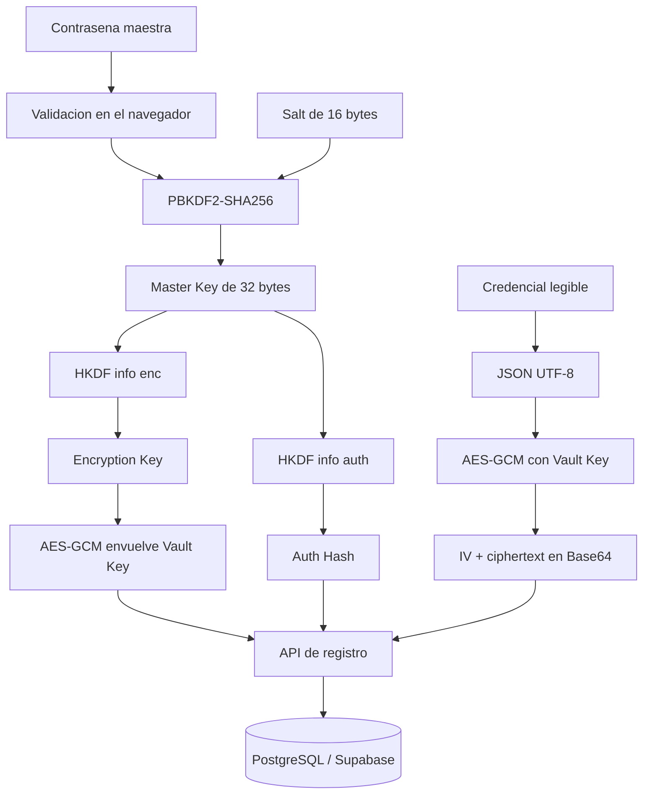

# Flujo actual del programa

Este documento describe la implementacion que existe actualmente en el repositorio. Explica por donde pasan los datos, que se cifra en el navegador, que recibe el servidor y que se almacena en Supabase.

## 1. Componentes

- **Cliente:** React + TypeScript + Vite.
- **Criptografia del cliente:** Web Crypto API (`crypto.subtle`).
- **Servidor:** Node.js + Express.
- **Base de datos:** PostgreSQL alojado en Supabase.
- **Sesion:** JWT dentro de una cookie `httpOnly`.
- **Hash del servidor:** `bcryptjs` aplicado al `authHash` recibido del cliente.
- **Validacion:** Zod en el servidor y validadores propios en el cliente.

> El plan original menciona Argon2 como primera opcion, pero el codigo actual utiliza `bcryptjs`.

## 2. Vista general del flujo



La contrasena maestra y las credenciales legibles nunca se envian al backend. El servidor recibe material derivado, blobs cifrados y metadatos necesarios para identificar la cuenta.

## 3. Registro de una cuenta

El flujo comienza en `registerWithMasterPassword` del cliente.

### Paso 1: validacion

El cliente valida el email y la contrasena maestra antes de ejecutar criptografia o realizar peticiones HTTP.

- El email debe tener un formato valido.
- La contrasena maestra debe tener entre 12 y 42 caracteres.
- La contrasena maestra permanece en memoria durante la operacion.

### Paso 2: generacion del salt

El navegador genera un salt aleatorio de 16 bytes usando:

```js
crypto.getRandomValues(new Uint8Array(16))
```

El salt no es secreto. Su funcion es evitar que la misma contrasena produzca siempre la misma clave entre cuentas.

### Paso 3: derivacion de la Master Key

El navegador aplica PBKDF2-HMAC-SHA256:

```text
Master Key = PBKDF2-SHA256(contrasena maestra, salt, 600000 iteraciones)
```

El resultado es una clave de 32 bytes. La contrasena maestra se convierte a bytes UTF-8 dentro del navegador y no abandona este proceso.

### Paso 4: separacion mediante HKDF

A partir de la Master Key se derivan dos materiales independientes mediante HKDF-SHA256:

```text
Encryption Key   = HKDF-SHA256(Master Key, info = "enc")
Auth Key Material = HKDF-SHA256(Master Key, info = "auth")
```

Los valores `enc` y `auth` son contextos diferentes. Esto evita reutilizar el mismo material directamente para cifrar y autenticar.

- `Encryption Key`: clave AES-GCM de 256 bits.
- `Auth Key Material`: 32 bytes que se convierten a Base64 y forman el `authHash`.

### Paso 5: generacion y envoltura de la Vault Key

El cliente genera una Vault Key aleatoria de 32 bytes. Esta clave sera la que cifre las credenciales de la boveda.

Despues:

1. Se genera un `wrapIv` aleatorio de 12 bytes.
2. Se cifra la Vault Key con AES-GCM usando la Encryption Key y el `wrapIv`.
3. El resultado incluye el ciphertext y el tag de autenticacion de 128 bits.
4. La Vault Key envuelta y el IV se convierten a Base64.

```text
wrappedVaultKey = AES-GCM(Encryption Key, wrapIv, Vault Key)
```

La Vault Key original solo queda en memoria del cliente. No se guarda directamente en `localStorage`, `sessionStorage` ni en la base de datos.

### Paso 6: peticion de registro

El cliente envia a `POST /api/auth/register` un JSON con:

```json
{
  "email": "usuario@example.com",
  "kdfSalt": "salt-en-base64",
  "kdfIterations": 600000,
  "authHash": "material-derivado-en-base64",
  "wrappedVaultKey": "vault-key-cifrada-en-base64",
  "wrapIv": "iv-de-12-bytes-en-base64"
}
```

No se envia:

- La contrasena maestra.
- La Master Key.
- La Encryption Key.
- La Vault Key sin cifrar.
- Ninguna credencial de la boveda.

### Paso 7: procesamiento en el servidor

El servidor valida la forma del JSON con Zod y comprueba los tamanos de los valores Base64.

Luego:

1. Convierte el `authHash` Base64 a bytes.
2. Lo vuelve a representar como Base64.
3. Aplica `bcryptjs` con coste 12.
4. Guarda el resultado en `users.auth_hash_hashed`.
5. Guarda el `kdf_salt`, las iteraciones, `wrapped_vault_key` y `wrap_iv`.

El servidor nunca deriva claves desde la contrasena maestra y nunca descifra la Vault Key.

## 4. Inicio de sesion

El flujo comienza en `loginWithMasterPassword`.

### Paso 1: solicitud del salt

El cliente envia:

```text
GET /api/auth/salt?email=usuario%40example.com
```

El servidor devuelve el `kdfSalt` y `kdfIterations` de la cuenta. Si el email no existe, devuelve un salt falso determinista para que la respuesta mantenga una estructura similar y no revele facilmente si una cuenta esta registrada.

### Paso 2: reproduccion local de las claves

El cliente decodifica el salt Base64 y repite exactamente la derivacion:

```text
Master Key = PBKDF2-SHA256(contrasena maestra, salt recibido, iteraciones recibidas)
Encryption Key = HKDF-SHA256(Master Key, info = "enc")
Auth Hash = Base64(HKDF-SHA256(Master Key, info = "auth"))
```

Si la contrasena maestra es correcta, el `authHash` coincide con el que se genero durante el registro.

### Paso 3: verificacion en el servidor

El cliente envia a `POST /api/auth/login` solamente:

```json
{
  "email": "usuario@example.com",
  "authHash": "material-derivado-en-base64"
}
```

El servidor:

1. Busca el usuario por email.
2. Obtiene `auth_hash_hashed`.
3. Ejecuta `bcrypt.compare(authHash, auth_hash_hashed)`.
4. Si es valido, crea un JWT firmado con el identificador del usuario.
5. Envia el JWT en una cookie `httpOnly`, `SameSite=Strict` y con una duracion de 8 horas.
6. Devuelve `wrappedVaultKey` y `wrapIv`.

El JWT identifica la sesion, pero no contiene la Vault Key ni las credenciales.

### Paso 4: recuperacion de la Vault Key

El cliente recibe el blob cifrado y lo descifra localmente:

```text
Vault Key = AES-GCM-Decrypt(Encryption Key, wrapIv, wrappedVaultKey)
```

Si la contrasena es incorrecta, la autenticacion falla o AES-GCM no puede validar el blob. La Vault Key recuperada se guarda solo en la variable de memoria `vaultKey`.

## 5. Guardar una credencial

## 5.1 Cambio de contraseña maestra

El cambio se realiza sin enviar ninguna contraseña al servidor y sin modificar los ciphertexts existentes:

1. El cliente deriva el `currentAuthHash` con el salt y las iteraciones actuales.
2. Genera un salt nuevo y deriva el nuevo `authHash` y la nueva `Encryption Key`.
3. Envuelve la misma `Vault Key` con la nueva `Encryption Key` y un IV nuevo.
4. Envía únicamente derivados, metadatos KDF y blobs Base64 a `POST /api/auth/change-password`.
5. El servidor verifica el material actual, actualiza todo dentro de una transacción e incrementa `session_version`.
6. Se invalida la cookie actual y todas las sesiones anteriores; el usuario debe iniciar sesión de nuevo.

La `Vault Key` no cambia, por lo que los items guardados siguen siendo descifrables tras el nuevo login.

El usuario introduce:

```json
{
  "title": "Correo",
  "username": "usuario@example.com",
  "password": "contraseña-del-servicio",
  "url": "https://example.com"
}
```

### Paso 1: validacion local

El cliente comprueba los limites de longitud, los campos obligatorios y que la URL, si existe, use `http` o `https`.

### Paso 2: serializacion

La credencial se convierte a JSON y despues a bytes UTF-8. Puede contener una
lista de URLs, que se cifra dentro del mismo objeto junto con el resto de campos:

```json
{"title":"Correo","username":"ana","password":"...","urls":["https://mail.example","https://webmail.example"]}
```

```text
JSON.stringify(credential) -> TextEncoder -> bytes
```

### Paso 3: cifrado AES-GCM

El cliente genera un IV aleatorio nuevo de 12 bytes para esa escritura:

```text
ciphertext = AES-GCM(Vault Key, IV, JSON de la credencial)
```

AES-GCM produce el ciphertext junto con su tag de autenticacion de 128 bits. El tag permite detectar modificaciones o una clave incorrecta al descifrar.

### Paso 4: conversion a Base64

El IV y el ciphertext se convierten a Base64 para poder enviarlos dentro de JSON:

```json
{
  "iv": "iv-aleatorio-en-base64",
  "ciphertext": "credencial-cifrada-en-base64"
}
```

### Paso 5: almacenamiento

El cliente envia el objeto a `POST /api/vault` con la cookie de sesion incluida por el navegador.

El servidor:

1. Valida la cookie JWT mediante `requireAuth`.
2. Obtiene el `userId` desde el campo `sub` del JWT.
3. Valida `iv` y `ciphertext` con Zod.
4. Inserta ambos valores junto con `user_id`.
5. No descifra ni interpreta el contenido.

La tabla `vault_items` almacena solamente:

- `user_id`.
- `iv`.
- `ciphertext`.
- Fechas e identificador técnico.

## 6. Leer credenciales

El cliente solicita:

```text
GET /api/vault
```

La cookie de sesion viaja automaticamente. El servidor valida el JWT y consulta solo las filas cuyo `user_id` coincide con el usuario autenticado.

El servidor devuelve una lista de blobs:

```json
[
  {
    "id": 1,
    "iv": "...",
    "ciphertext": "...",
    "createdAt": "...",
    "updatedAt": "..."
  }
]
```

Para cada fila, el cliente ejecuta:

```text
bytes = Base64Decode(ciphertext)
plaintext = AES-GCM-Decrypt(Vault Key, iv, bytes)
credential = JSON.parse(TextDecoder(plaintext))
```

El servidor nunca recibe el JSON legible. La recuperacion ocurre exclusivamente en el navegador.

## 7. Editar y eliminar

### Editar

Editar una credencial repite el flujo de guardado:

1. Validacion local.
2. Serializacion a JSON.
3. Generacion de un IV nuevo.
4. Cifrado AES-GCM con la Vault Key.
5. Peticion `PUT /api/vault/:id`.
6. El servidor actualiza solo si el item pertenece al usuario autenticado.

No se reutiliza el IV anterior para el nuevo ciphertext.

### Eliminar

Para eliminar, el cliente envia `DELETE /api/vault/:id`.

El servidor ejecuta la eliminacion usando simultaneamente el identificador del item y el `user_id` de la sesion. Un usuario no puede borrar un item perteneciente a otra cuenta.

## 8. Cierre de sesion

Al cerrar sesion:

1. El cliente envia `POST /api/auth/logout`.
2. El servidor elimina la cookie de sesion.
3. El cliente ejecuta `vaultKey = null` en un bloque `finally`.
4. La interfaz elimina las credenciales descifradas de su estado local.

La clave de la boveda no se persiste para recuperarla automaticamente despues de cerrar la sesion.

## 9. Datos visibles en cada capa

| Capa | Puede ver | No debe ver |
|---|---|---|
| Formulario del navegador | Contrasena maestra y credencial mientras se editan | Nada fuera de la memoria de la pagina |
| Cliente criptografico | Master Key, Encryption Key, Auth Hash y Vault Key durante la sesion | Persistencia de esas claves en Web Storage |
| Red | Email, salt, iteraciones, Auth Hash, blobs Base64 y cookie de sesion | Contrasena maestra, Vault Key sin cifrar y credenciales legibles |
| Servidor | Email, Auth Hash recibido, hashes bcrypt, blobs, IVs, JWT y metadatos | Contrasena maestra, Master Key, Encryption Key y JSON de credenciales |
| Supabase | Hash bcrypt, salt, iteraciones, `wrapped_vault_key`, `wrap_iv`, IVs y ciphertexts | Credenciales legibles y claves sin envolver |

## 10. Comprobacion manual

Para revisar el almacenamiento, abre el SQL Editor de Supabase y ejecuta:

```sql
SELECT * FROM users;
SELECT * FROM vault_items;
```

Los campos `auth_hash_hashed`, `wrapped_vault_key`, `wrap_iv`, `iv` y `ciphertext` deben aparecer como hashes o cadenas Base64. No deben contener directamente titulos, usuarios, contrasenas o URLs legibles.

Para revisar la red, abre DevTools, entra en **Network** y observa las peticiones de registro, login y `/api/vault`. Comprueba que los cuerpos contienen solo material derivado o cifrado.

## 11. Limitacion importante

Este modelo protege los datos frente a un servidor que almacena o transporta la informacion, pero el servidor de frontend entrega el JavaScript que ejecuta el cifrado. Si ese JavaScript fuese sustituido por una version maliciosa antes de llegar al navegador, podria capturar datos antes del cifrado.

La CSP, SRI, la revision del codigo y una cadena de despliegue confiable reducen ese riesgo, pero no lo eliminan completamente.
