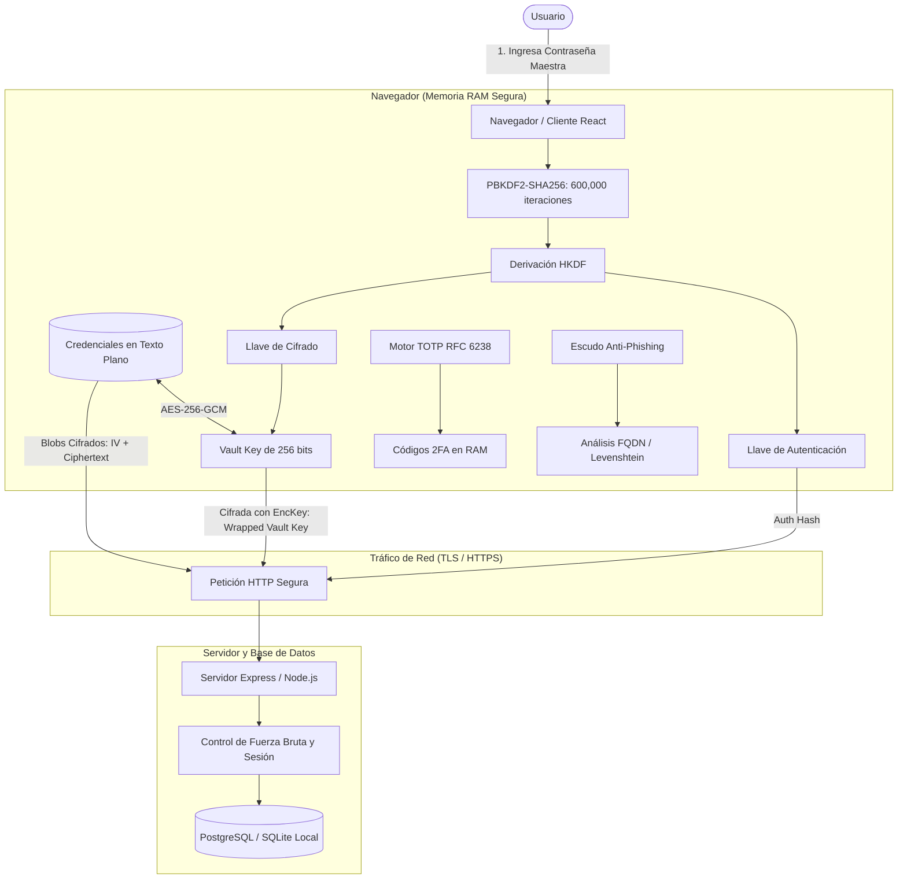
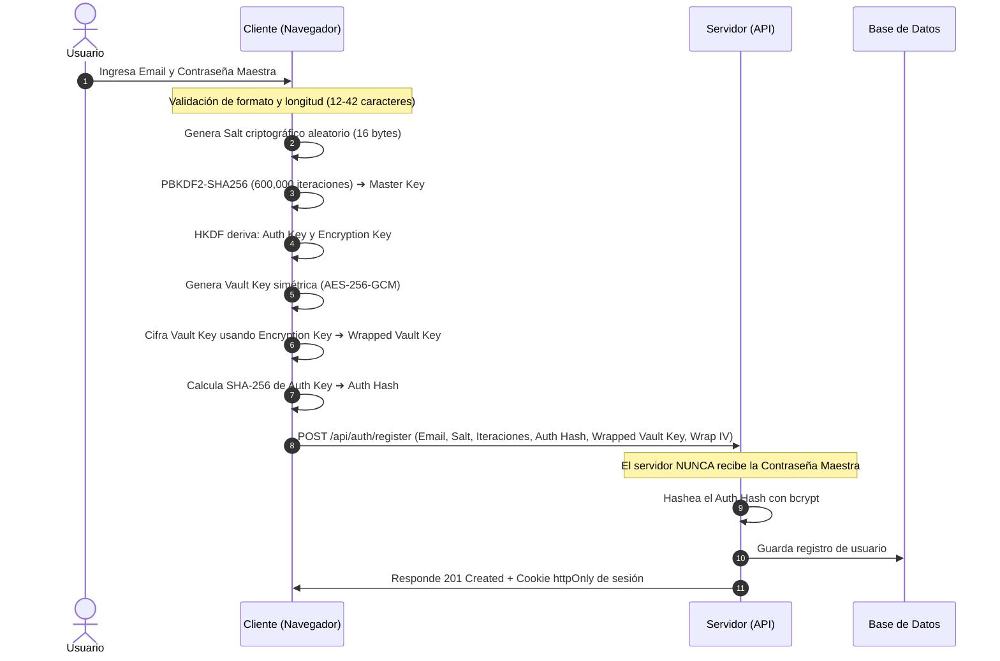
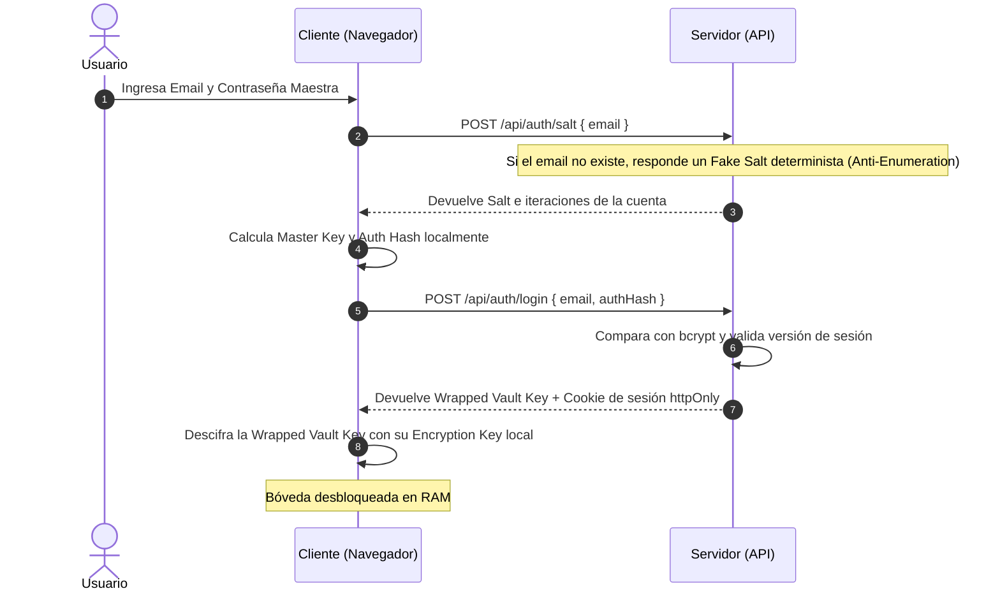
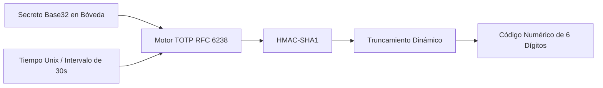
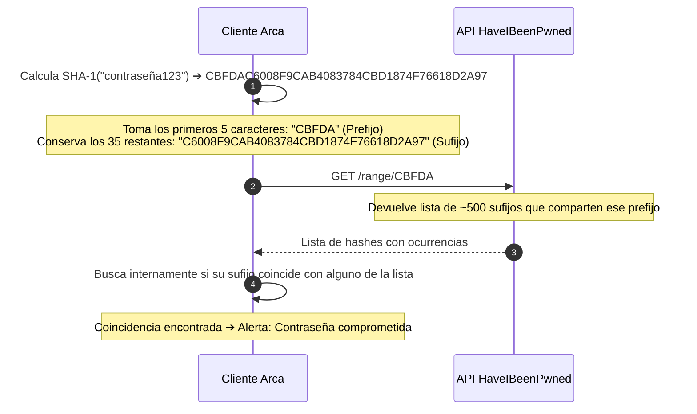

# 🛡️ Guía Integral de Procesos del Sistema — Arca Password Manager

Esta documentación describe de forma clara, didáctica y estructurada todos los procesos y subsistemas que componen **Arca**. Ha sido diseñada tanto para desarrolladores y auditores de seguridad como para una audiencia académica y técnica general.

---

## 📑 Tabla de Contenidos

1. [Filosofía y Arquitectura Zero-Knowledge](#1-filosofía-y-arquitectura-zero-knowledge)
2. [Mapa General de Procesos](#2-mapa-general-de-procesos)
3. [Proceso 1: Registro y Creación de Bóveda](#proceso-1-registro-y-creación-de-bóveda)
4. [Proceso 2: Desbloqueo e Inicio de Sesión](#proceso-2-desbloqueo-e-inicio-de-sesión)
5. [Proceso 3: Almacenamiento y Descifrado de Credenciales](#proceso-3-almacenamiento-y-descifrado-de-credenciales)
6. [Proceso 4: Generador Criptoseguro de Contraseñas](#proceso-4-generador-criptoseguro-de-contraseñas)
7. [Proceso 5: Códigos de Autenticación 2FA (TOTP)](#proceso-5-códigos-de-autenticación-2fa-totp)
8. [Proceso 6: Auditoría de Seguridad y Detección de Fugas (HIBP)](#proceso-6-auditoría-de-seguridad-y-detección-de-fugas-hibp)
9. [Proceso 7: Escudo Anti-Phishing y Verificación de Dominios](#proceso-7-escudo-anti-phishing-y-verificación-de-dominios)
10. [Proceso 8: Extensión de Navegador Guard](#proceso-8-extensión-de-navegador-guard)
11. [Proceso 9: Seguridad en Backend y Persistencia](#proceso-9-seguridad-en-backend-y-persistencia)
12. [Glosario Técnico Simplificado](#12-glosario-técnico-simplificado)

---

## 1. Filosofía y Arquitectura Zero-Knowledge

En un gestor de contraseñas tradicional, los datos se envían a un servidor que los custodia. Si el servidor es vulnerado, los atacantes pueden acceder a la información.

**Arca implementa un modelo de Conocimiento Cero (Zero-Knowledge / Zero-Trust):**
* **Tu contraseña maestra nunca sale de tu navegador:** No se envía por la red ni se guarda en ninguna base de datos ni archivo de registro.
* **Cifrado de extremo a extremo:** Toda la información se cifra en tu dispositivo antes de viajar al servidor.
* **El servidor es ciego:** Aunque un atacante obtenga acceso completo a la base de datos de Arca, solo verá cadenas de datos aleatorios e incomprensibles (*ciphertext*).

---

## 2. Mapa General de Procesos



---

## Proceso 1: Registro y Creación de Bóveda



1. **Entrada de datos**: El usuario proporciona su correo y su contraseña maestra.
2. **Generación del Salt**: Se crea una semilla criptográfica única (`crypto.getRandomValues`) para evitar ataques de tablas arcoíris (*rainbow tables*).
3. **Derivación Robusta**: Se aplican **600,000 iteraciones** de PBKDF2 con SHA-256, siguiendo los estándares NIST y OWASP para hacer inviable cualquier ataque de fuerza bruta por GPU.
4. **Separación de Privilegios (HKDF)**: Se divide el material en dos funciones estrictamente separadas:
   * **Auth Key**: Se usa exclusivamente para demostrarle al servidor quién es el usuario.
   * **Encryption Key**: Se usa exclusivamente para proteger la llave maestra de la bóveda.
5. **Llave de la Bóveda (Envelope Encryption)**: Se crea una llave aleatoria AES-256 que cifrará todas las contraseñas. Esta llave se guarda empaquetada (*wrapped*) y cifrada.

---

## Proceso 2: Desbloqueo e Inicio de Sesión



* **Protección contra enumeración de usuarios**: Si alguien ingresa un correo que no está registrado, el servidor genera un *salt falso determinista*. El tiempo de respuesta es idéntico, impidiendo que un atacante descubra si una cuenta existe o no.
* **Verificación Ciega**: El servidor compara el hash recibido contra el hash almacenado en base de datos. En ningún momento viajó la contraseña.
* **Desempaque en RAM**: La `Vault Key` se descifra en la memoria volátil del navegador y se destruye inmediatamente al cerrar sesión.

---

## Proceso 3: Almacenamiento y Descifrado de Credenciales

Cada cuenta, servicio o contraseña añadida a Arca se almacena de forma aislada e independiente:

1. **Estructuración en JSON**: La información (título, usuario, contraseña, notas, URLs, secreto TOTP, favorito) se serializa en UTF-8.
2. **Vector de Inicialización Único (IV)**: Para cada guardado o actualización se generan **12 bytes criptográficos aleatorios**. Dos credenciales con la misma contraseña generan textos cifrados totalmente distintos.
3. **Cifrado Autenticado (AES-256-GCM)**: Proporciona **confidencialidad** (nadie puede leer los datos) e **integridad** (si alguien altera un solo bit en la base de datos, el algoritmo detecta la manipulación y rechaza descifrarlo).
4. **Visualización Segura**: La contraseña permanece oculta tras asteriscos. Al pulsar el botón de revelado o copiado, se desencripta en memoria temporalmente sin tocar el almacenamiento local (*localStorage*).

---

## Proceso 4: Generador Criptoseguro de Contraseñas

Arca cuenta con un generador integrado para crear contraseñas de alta entropía:

* **Fuente de Entropía Segura**: Utiliza `crypto.getRandomValues()`, garantizando números pseudoaleatorios de grado criptográfico (CSPRNG).
* **Garantía de Conjuntos**: Asegura que el resultado contenga al menos un carácter de cada tipo seleccionado (mayúsculas, minúsculas, números y símbolos).
* **Algoritmo Fisher-Yates**: Mezcla uniformemente los caracteres para eliminar cualquier sesgo predecible en las posiciones.

---

## Proceso 5: Códigos de Autenticación 2FA (TOTP)

Arca funciona como un autenticador de segundo factor integrado (compatible con Google Authenticator / Authy):



* **Operación 100% Local**: La generación de códigos se realiza en el navegador mediante operaciones de bits y HMAC-SHA1.
* **Sin Dependencias de Nube**: El secreto TOTP viaja cifrado dentro del blob de la credencial y solo se ejecuta en local, sin enviar peticiones a APIs externas.

---

## Proceso 6: Auditoría de Seguridad y Detección de Fugas (HIBP)

Arca audita periódicamente la salud de las contraseñas sin poner en riesgo la privacidad del usuario:

### 1. Cálculo de Entropía y Detección de Reutilización
* Analiza el tamaño del conjunto de caracteres y la longitud para estimar los bits de entropía.
* Agrupa contraseñas idénticas entre diferentes cuentas para alertar sobre reutilización peligrosa.

### 2. Consulta a Have I Been Pwned mediante $k$-Anonimato
¿Cómo sabemos si una contraseña fue filtrada en internet sin revelarla?



> **Garantía de Privacidad**: HIBP solo recibe 5 caracteres hexadecimales comunes a cientos de contraseñas distintas; es matemáticamente imposible que el servicio sepa cuál es tu contraseña real.

---

## Proceso 7: Escudo Anti-Phishing y Verificación de Dominios

Para proteger al usuario contra páginas trampa, sitios falsos y ataques de suplantación de identidad (*typosquatting* y *homograph attacks*):

```mermaid
flowchart TD
    UrlIn[URL ingresada en Credencial] --> Norm[Normalización RFC 3986 & Punycode]
    Norm --> CheckHomo{¿Caracteres cirílicos/homógrafos?}
    CheckHomo -- Sí --> BlockSpoof[Riesgo Crítico: Suplantación Homográfica]
    CheckHomo -- No --> PSL[Extracción eTLD+1 mediante Public Suffix List]
    
    PSL --> Exact{¿Coincidencia con Catálogo Oficial?}
    Exact -- Sí + HTTPS --> SafeOfficial[Oficial Verificado: TLS Activo]
    Exact -- No --> TypoCheck{¿Distancia Levenshtein <= 2 o subdominio falso?}
    TypoCheck -- Sí --> AlertTypo[Alerta: Posible imitación de [Servicio]]
    TypoCheck -- No --> CustomDomain[Dominio Personalizado Válido]
```

* **Detección de Posible Imitación**: Compara el dominio contra un catálogo de entidades críticas (Google, PayPal, Netflix, Microsoft, bancos). Si alguien escribe `gogle.com` o `netflx.com`, el motor detecta la similitud.
* **Interfaz Minimalista y de Acción Rápida**:
  * Muestra el aviso formal: `Posible imitación de [servicio oficial]`.
  * Ofrece un botón azul directo: `Cambiar a https://[servicio oficial]`.
  * Ofrece la opción secundaria: `Eliminar enlace`.
* **Bloqueo Preventivo**: El formulario desactiva el botón de guardar y muestra un mensaje de advertencia si la URL es peligrosa, impidiendo almacenar enlaces fraudulentos en la bóveda.

---

## Proceso 8: Extensión de Navegador Guard

La extensión de Arca (disponible en la carpeta [`extension/`](file:///c:/Users/Alejandra/Desktop/Gestor_de_contrase-as_IS2/extension)) protege activamente la navegación del usuario en tiempo real:

1. **Inspección de Pestaña Activa**: El `content_script` extrae el FQDN de la página donde se encuentra el usuario.
2. **Validación FQDN Estricta**: Consulta a la bóveda si existen credenciales para ese dominio exacto.
3. **Bloqueo de Autocompletado Ciego**: Si el usuario está en `paypal-seguridad.com`, la extensión detecta que el dominio no coincide con `paypal.com` e impide que se autocompleten las credenciales bancarias.

---

## Proceso 9: Seguridad en Backend y Persistencia

El backend actúa como un custodio seguro que implementa defensas en profundidad:

* **Invalidación Global de Sesiones (`session_version`)**: Cada usuario posee un contador de versión. Al cambiar la contraseña maestra, la versión se incrementa en la base de datos, invalidando automáticamente todas las sesiones abiertas en cualquier otro dispositivo.
* **Mitigación de Fuerza Bruta**: Un contador en memoria rastrea los intentos fallidos por correo. Al 5to intento incorrecto consecutivo, la cuenta se bloquea temporalmente por 15 minutos.
* **Cabeceras de Seguridad y CSP Estricto**:
  * `Content-Security-Policy`: Solo permite scripts y estilos autorizados con hashes SRI (*Subresource Integrity*).
  * `X-Frame-Options: DENY`: Evita ataques de *clickjacking*.
  * `httpOnly`, `SameSite=Strict`: Cookies inmunes al robo mediante scripts maliciosos (XSS).
* **Compatibilidad de Persistencia Dual**:
  * **PostgreSQL (Supabase)** para despliegues en producción y alta disponibilidad.
  * **SQLite Local Autónomo (`node:sqlite`)** para desarrollo y pruebas locales sin necesidad de configurar servicios externos.

---

## 12. Glosario Técnico Simplificado

| Término | Definición Cotidiana |
| :--- | :--- |
| **Zero-Knowledge** | Modelo de diseño donde el servidor gestiona tus datos sin tener la capacidad técnica de conocerlos ni descifrarlos. |
| **PBKDF2** | Función matemática de derivación de claves que aplica miles de iteraciones para que a un hacker le cueste semanas probar combinaciones. |
| **AES-256-GCM** | Estándar de cifrado simétrico que bloquea los datos con una llave de 256 bits y certifica que nadie los haya modificado en el camino. |
| **Salt (Sal)** | Cadena aleatoria única que se añade a la contraseña antes de procesarla para que dos contraseñas iguales tengan huellas totalmente diferentes. |
| **IV (Vector de Inicialización)** | Número aleatorio que se utiliza una sola vez por cada operación de cifrado para evitar patrones repetitivos. |
| **eTLD+1** | El dominio público registrable de una web (por ejemplo, en `login.banco.com.co`, el eTLD+1 es `banco.com.co`). |
| **Typosquatting** | Técnica de ciberdelincuencia basada en registrar dominios con errores ortográficos de marcas famosas para engañar a los usuarios. |
| **$k$-Anonimato** | Principio de privacidad que permite verificar información agrupándola con cientos de registros similares para que la identidad individual no pueda ser descubierta. |
